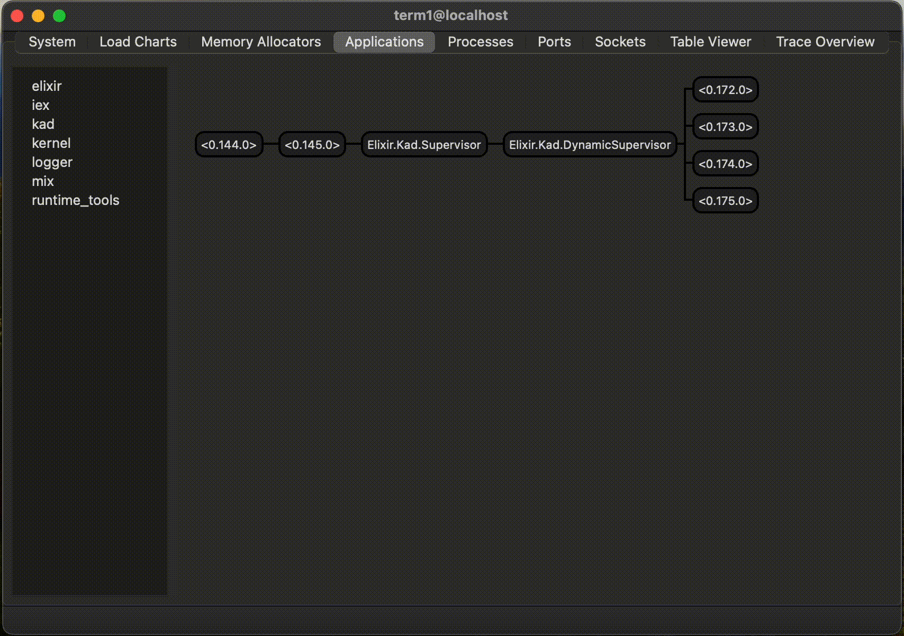

# Kad

**A DHT simulator based on Kademlia**

Kad is a Distributed Hash Table (DHT) simulator based on [Kademlia protocol](https://en.wikipedia.org/wiki/Kademlia#:~:text=Kademlia%20is%20a%20distributed%20hash,of%20information%20through%20node%20lookups.). The main purpose is to help understand Kademlia protocol and as a sandbox for further experiments around DHTs and Kademlia.

## How it works

- Nodes in a network is represented by Erlang processes, which helps us to simulate 1000s of nodes. Each process will behave like a kademlia node with its own routing table and other metadata.

- Instead of RPC calls, we use Erlang Process messaging.

- Process PIDs replaces UDP endpoint

## Running

### Prerequisite

Install [Erlang and Elixir](https://thinkingelixir.com/install-elixir-using-asdf/)

`git clone git@github.com:madclaws/kad.git`

There are 2 modes of simulation, 

### minikad

Minikad works in 6-bit space, ie the keys and the nodes share same 6-bit space, so keys can be 
numbers from 0-63, likewise nodes. This mode is good for learning how Kademlia works. Its easier to understand, but beware of conflict in the bit-space.

### megakad

Megakad works in 160-bit space, just like large scale kademlia network, ie the keys and the nodes share same 160-bit space. Given the large bitspace we don't have to worry about conflict btw nodes and keys. Also in megakad the keys can be basically any erlang term unlike in minikad it must be an integer (0-63)

Upon starting the sim, it also opens erlang's observer for further observability into the nodes and states.



Open a terminal and run

`iex --sname term1@localhost -S mix`

From the iex shell

```sh
iex(term1@localhost) Kad.minikad
```

OR 

```sh
iex(term1@localhost) Kad.megakad
```

In another terminal

`iex --sname term2@localhost -S mix`

```sh
# connect_term, connects 2 separate terminals using distributed Elixir

iex(term2@localhost) Kad.connect_term

# This example is running minikad on first terminal
iex(term2@localhost) Kad.put(:node_50, 55, "apple")

iex(term2@localhost) Kad.get(:node_2, 55) # "apple"
```

See the logs in terminal1 and do the operations in terminal2

In the above example we add the KV pair (55, "apple") in node_50
And we still get the value of 55, even if query from node_2

**NOTE: For megakad the nodeID will be sha1 binary so we don't need to use it as atom while calling any Kad functions, it can be normal string like below,**

`Kad.get("d4f86a7c1e9b5f2d3c8a1b7e5f9d4c2a3e6f8b9d", "apple", "fruit")`

### Other functions

- `Kad.start_node([])` - Will add a new node to the network 

## Tests

`mix test`
